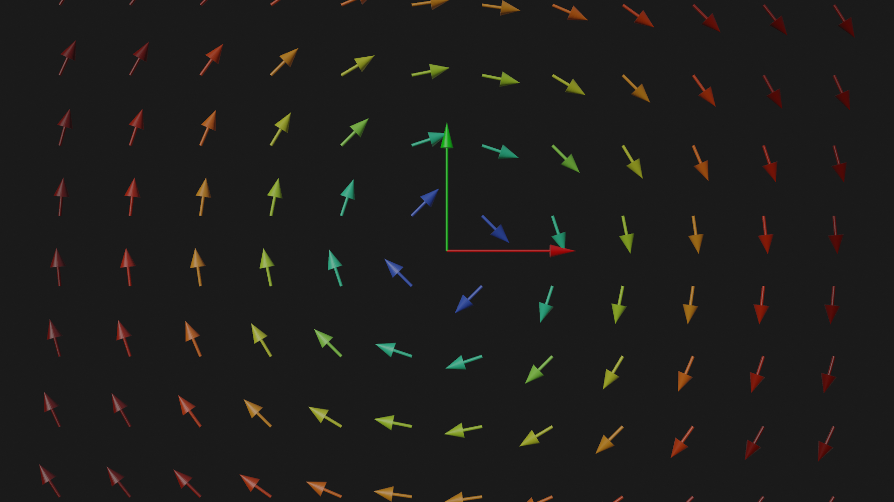

# 3D plots using Blender as a backend

## Plots

 2D                                     |  3D
:--------------------------------------:|:-------------------------:
  |  

## Animations

https://user-images.githubusercontent.com/25606125/172133325-cc756902-511a-402e-a9aa-438f135bdd1f.mp4

https://user-images.githubusercontent.com/25606125/172375672-cd114360-959a-4e17-9086-9c0af3cba387.mp4

## Build the docker file

Since a specefic version of python is required it is recomended to build and use the docker images.

```bash
./docker_builder.py
```

This will build blender 3.1 with python 3.10 as in an image called bpy-3.10:3.1.

To see the full list of build options use the `--help` flag.

### Launch a docker container with access to gpu and display

```bash
docker run -t -d \
    --gpus all \
    --net host \
    -v /tmp/.X11-unix:/tmp/.X11-unix \
    -e DISPLAY=$DISPLAY \
    --name belnder-plot-dev \
    bpy-3.10:3.1
```

### Notes

- blender 2.83 is not compiling correctly at the moment.
- you can copy the compiled module from the cotainer to the host machine if you have the basic dependencies and same
  python version
```bash
docker cp belnder-plot-dev:/home/docker/blender_tmp/build_linux_bpy/bin/bpy.so <path-to-python3.10-packages>
docker cp -r belnder-plot-dev:/home/docker/blender_tmp/build_linux_bpy/bin/3.1 <path-to-python3.10-packages>
```
 - compiling blender uses all the cores and is prone to run out of memory if you do not have enough RAM. Use the
   `--builder_cpus N` flag in the builder program to set the number of cores to use.
 - `FFMPEG` support is not correcly set. Animations can be saved as `.avi` and then converted to `.mp4` using the
   `ffmpeg` cli tools.

 - At the end of every script `bpy.ops.wm.quit_blender()` must be called to exit blender. Failings to do so will result
   in blender running in the background consuming a lot of processor time. If the computer starts to feel slow check
   `top` to look fo any processes with 100% CPU usage.

 ## See also

  - [Blender CLI Rendering](https://github.com/yuki-koyama/blender-cli-rendering) - A repo containing
    scripts and utils to render scenes using the `bpy` module.

  - [Blender BPY Python3.7](https://github.com/zocker-160/blender-bpy) - Blender as Python module in a Docker container. Working with Blender 2.93 and python 3.7.

  - [blenderpy](https://github.com/TylerGubala/blenderpy/releases/tag/v2.91a0) - See the release page for precompiled python wheels for easy installation. Limited to Blender 2.91 and python 3.7.
